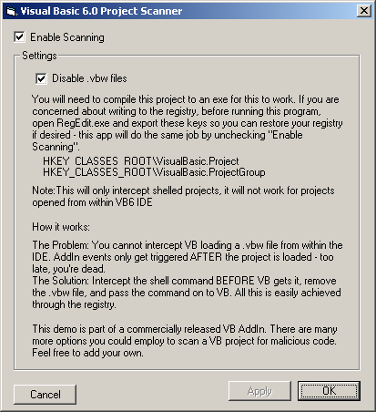

## Bobo VBW Disabler

### Description

Disable *.vbw files from running when you click on a VB6 Project file(*.vbp or *.vbg) in Explorer. Simple registry function to avoid malicious vbw files activating. No timers, no overhead, run once and your protected.
 
### More Info
 

             |
---                |---
**Submitted On**   |2003-02-09 01:13:56
**By**             |[MrBobo](https://github.com/Planet-Source-Code/PSCIndex/blob/master/ByAuthor/mrbobo.md)
**Level**          |Intermediate
**User Rating**    |4.8 (29 globes from 6 users)
**Compatibility**  |VB 6\.0
**Category**       |[VB function enhancement](https://github.com/Planet-Source-Code/PSCIndex/blob/master/ByCategory/vb-function-enhancement__1-25.md)
**World**          |[Visual Basic](https://github.com/Planet-Source-Code/PSCIndex/blob/master/ByWorld/visual-basic.md)
**Archive File**   |[Bobo\_VBW\_D1542092102003\.zip](https://github.com/Planet-Source-Code/mrbobo-bobo-vbw-disabler__1-43048/archive/master.zip)

